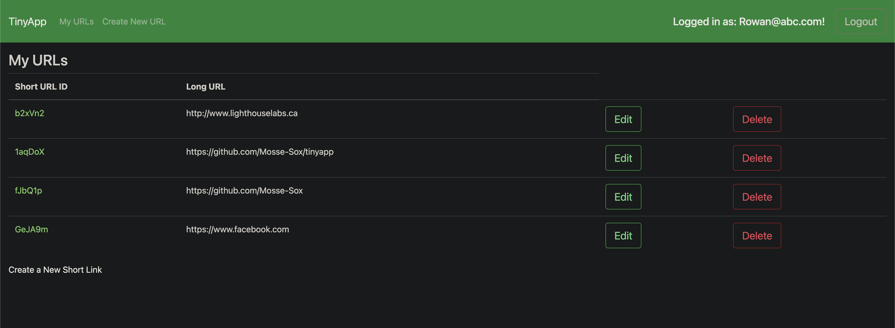

# TinyApp - LHL Project

### Turn your super long urls, super short.

This apps main purpose is to shorten URLS to share them across the web. Something like `https://www.google.com/searchq=beans&oq=beans&aqs=chrome..69i57.239693308j0j15&sourceid=chrome&ie=UTF-8` into something like this `www.tinyapp.com/u/abcxyz`.

## Final Product

- ## Key Features:
  - Authentication with encrypted cookies and hashed passwords
  - Protected routes, everytime a request is made, a check is made to make sure the person making the request is authorized to do so
  - Only the user who creates the link may access it inside tinyapp, but everyone can use the /u/:id link.

 

- ## Setup:
  - Download
  - `npm install`
  - `npm start`
  - Go to `http://localhost:8080/` to get started.

 

- ## Dependencies:
  - bcryptjs
  - cookie-session
  - ejs
  - express
  - node.js

 

- ## Dev Dependencies:
  - chai
  - mocha
  - morgan
  - nodemon
